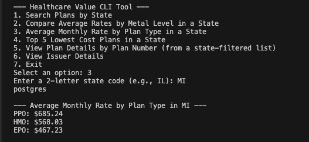

# **Healthcare Value Explorer:**
Comparing Cost & Benefits Across Plans & States

Created by Matthew Guy, Elizabeth Crawley, Sanja Romanishan 2025

A command-line based database navigation project using **PostgreSQL, Python, and Pandas**. This tool ingests CMS (Centers for Medicare & Medicaid Services) Public Use Files (PUFs), builds a relational database, and provides a CLI interface for users to interact with healthcare plan data. Users can explore plan availability, average rates, plan-level details, and issuer information across U.S. states.

---

## **Table of Contents**
- [Features](#features)
- [Installation](#installation)
- [Usage Instructions](#usage-instructions)
- [Dataset Details](#dataset-details)
- [CLI Functionality](#cli-functionality)
- [Demo Screenshots](#demo-screenshots)
- [Deployment](#deployment)
- [Future Enhancements](#future-enhancements)
- [About](#about)
- [Resources](#resources)

---

## **Features**

**Multi-Table PostgreSQL Database**: Healthcare plan data from CMS Public Use File Puffs https://www.cms.gov/marketplace/resources/data/public-use-files is transformed and loaded into normalized SQL tables.  
**ETL Pipeline**: Python scripts ingest, transform, and load CSV datasets into PostgreSQL using Pandas and SQLAlchemy.  
**Interactive CLI Tool**: Users can search plans by state, compare average rates, and retrieve detailed plan and issuer info.  
**Secure Database Access**: Prompts for PostgreSQL credentials at runtime using Python's `getpass`.  
**Filtered Queries**: Dental and SHOP plans are excluded by default to focus on qualified health plans only.

---

## **Installation**

### **Requirements**
- PostgreSQL 14+  
- Python 3.10+  
- VS Code or preferred IDE  
- Jupyter Notebook (optional for ETL step)

### **Quick Start Setup**

1. Clone or download this repository.
2. Navigate to the root directory of the project.
3. Run the five ETL Jupyter notebooks (in order):

&nbsp;&nbsp;&nbsp;&nbsp;📁 etl/  
&nbsp;&nbsp;&nbsp;&nbsp;├── issuer_etl.ipynb  
&nbsp;&nbsp;&nbsp;&nbsp;├── planatt_etl.ipynb  
&nbsp;&nbsp;&nbsp;&nbsp;├── rate_etl.ipynb  
&nbsp;&nbsp;&nbsp;&nbsp;├── service_area_etl.ipynb  
&nbsp;&nbsp;&nbsp;&nbsp;└── benefits_etl.ipynb  

4. Open the CLI tool script:

&nbsp;&nbsp;&nbsp;&nbsp;📄 healthcare_value_CLITool.py

5. Run the script in your terminal or VS Code terminal.

---

## **Usage Instructions**

- When prompted, enter your PostgreSQL password securely.
- Select from the menu of options to explore healthcare plan data:
  - Search plans by state
  - Compare average monthly rates by metal level
  - View average rate by plan type
  - See top 5 lowest cost plans
  - View plan details by selection
  - Get issuer contact info

- All queries return formatted outputs in the terminal for quick insight.

---

## **Dataset Details**

- **CMS Public Use Files (PUFs)**:
  - Benefits and Cost Sharing PUF  
  - Rate PUF  
  - Plan Attributes PUF  
  - Service Area PUF  
  - Issuer PUF

- **Transformations Applied**:
  - Dropped duplicate and null values  
  - Joined plan and rate tables  
  - Removed dental and SHOP plans  
  - Cleaned column names and types  
  - Converted rate fields to numeric for analysis

---

## **CLI Functionality**

- Built with **Python** and **psycopg2** to connect to PostgreSQL.
- Menu includes the following user options:

```
=== Healthcare Value CLI Tool ===
1. Search Plans by State
2. Compare Average Rates by Metal Level in a State
3. Average Monthly Rate by Plan Type in a State
4. Top 5 Lowest Cost Plans in a State
5. View Plan Details by Plan Number (from a state-filtered list)
6. View Issuer Details
7. Exit
```

- Logic includes input validation, SQL joins, and formatted terminal output.
- CLI serves as an interactive query assistant to the database.

---

---

## **CLI Demo Screenshots**

### CLI Menu Options


### Average Monthly Rate by Plan Type


### Top 5 Lowest Cost Plans in a State


### View Plan Details by Plan Number


---

## **Deployment**

To run the CLI tool locally:

1. Ensure PostgreSQL is installed and running.
2. Run all ETL Jupyter notebooks to build the database.
3. Open the terminal in VS Code.
4. Run the CLI script:
```bash
python healthcare_value_CLITool.py
```
5. Follow the on-screen prompts.

---

## **Future Enhancements**

- Add support for filtering by county or zip code  
- Export selected results to CSV  
- Add summary statistics (e.g. rate range, median)  
- Deploy as a Flask API for browser-based navigation

---

## **About**

This project was built as part of the **University of Denver Data Engineering Track**. It demonstrates mastery of relational databases, ETL workflows, and CLI-based user interaction for data exploration.

---

## **Resources**

- [CMS PUF Data Repository](https://www.cms.gov/CCIIO/Resources/Data-Resources/marketplace-puf)  
- [PostgreSQL Documentation](https://www.postgresql.org/docs/)  
- [Pandas Documentation](https://pandas.pydata.org/docs/)  
- [psycopg2 Library](https://www.psycopg.org/)  
- DU Bootcamp Modules 7, 8, 9, and 10  
- **ChatGPT** – Used to debug SQL joins, CLI structure, and script logic
